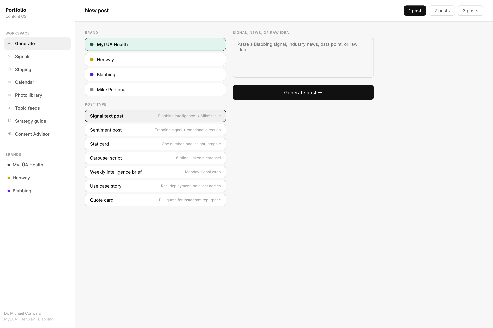
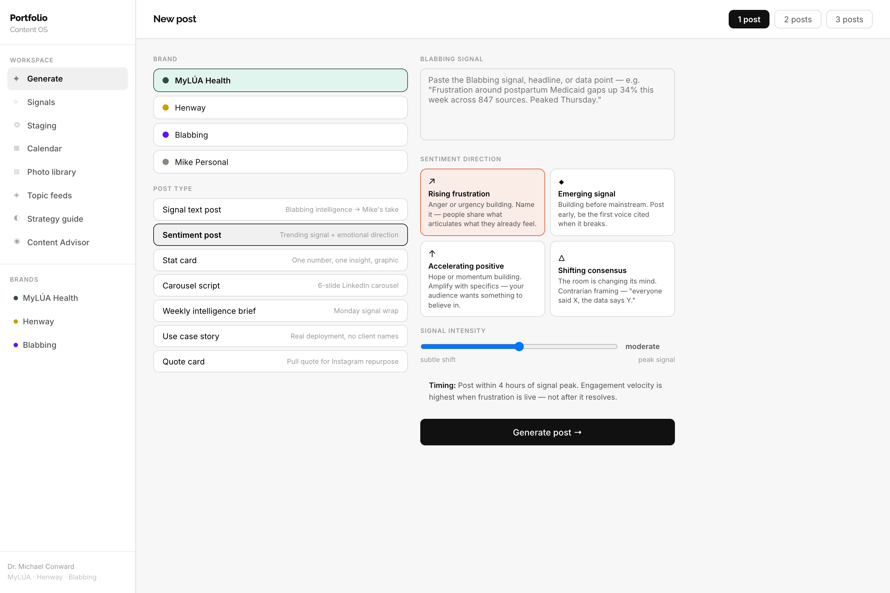
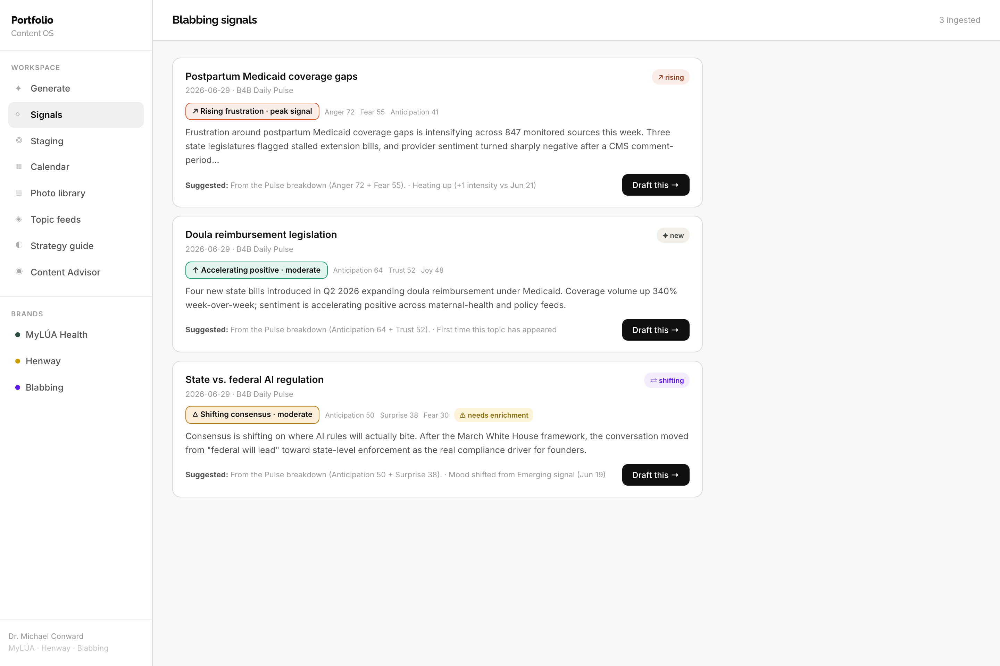
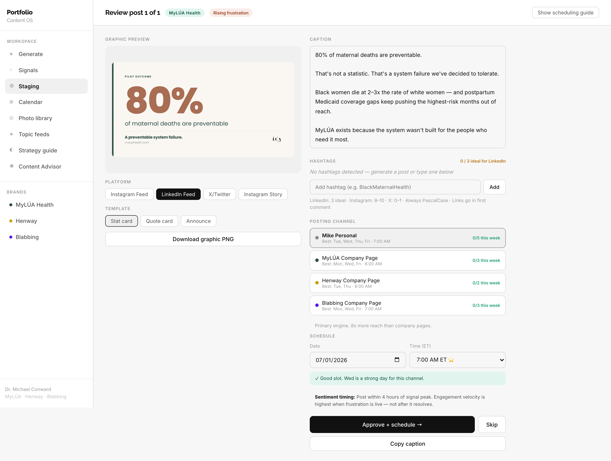
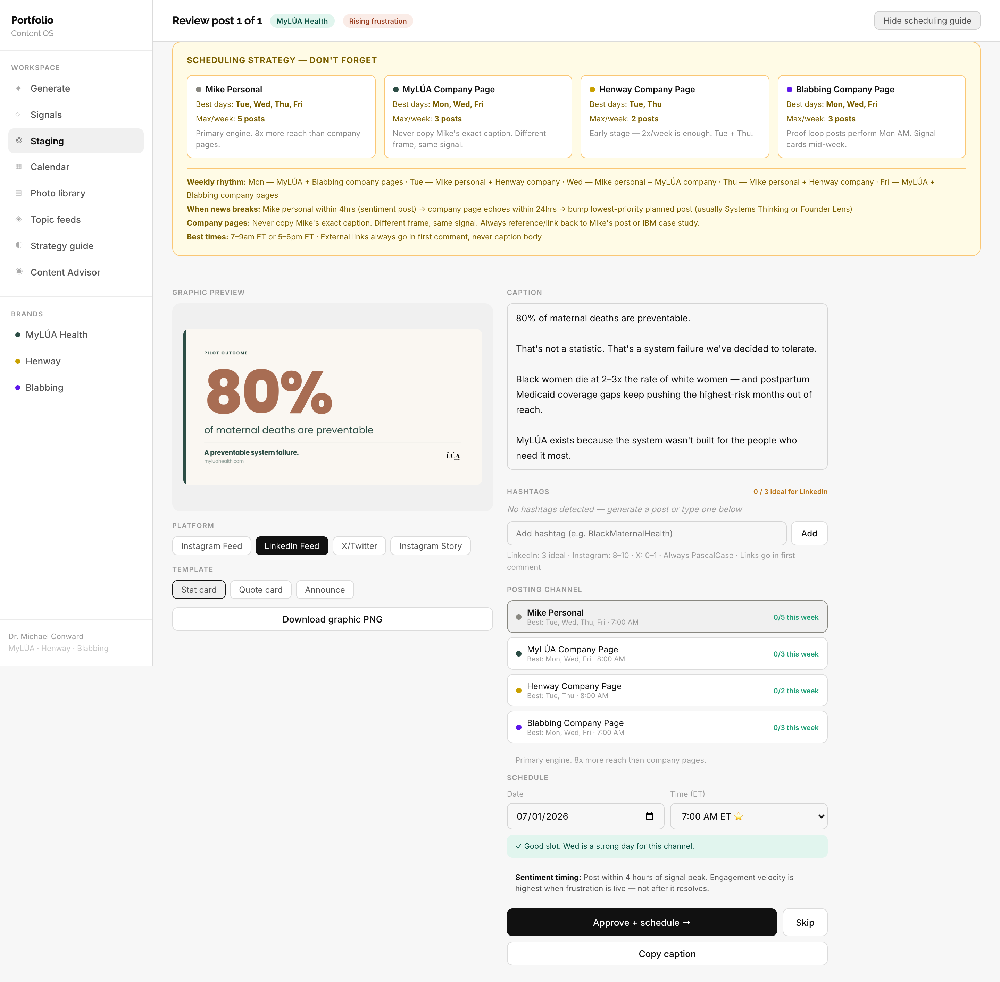
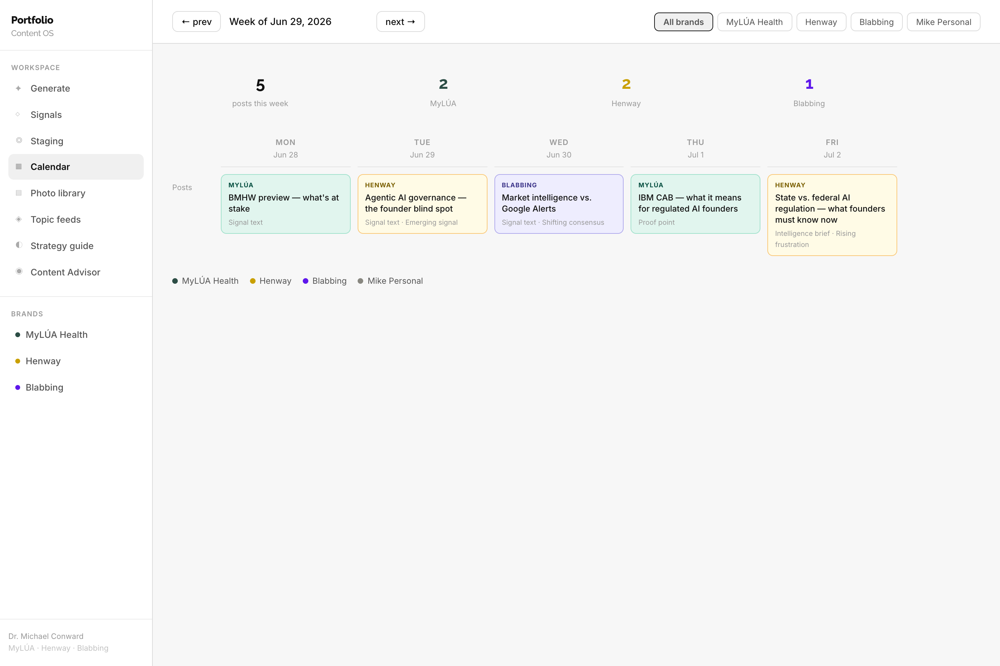
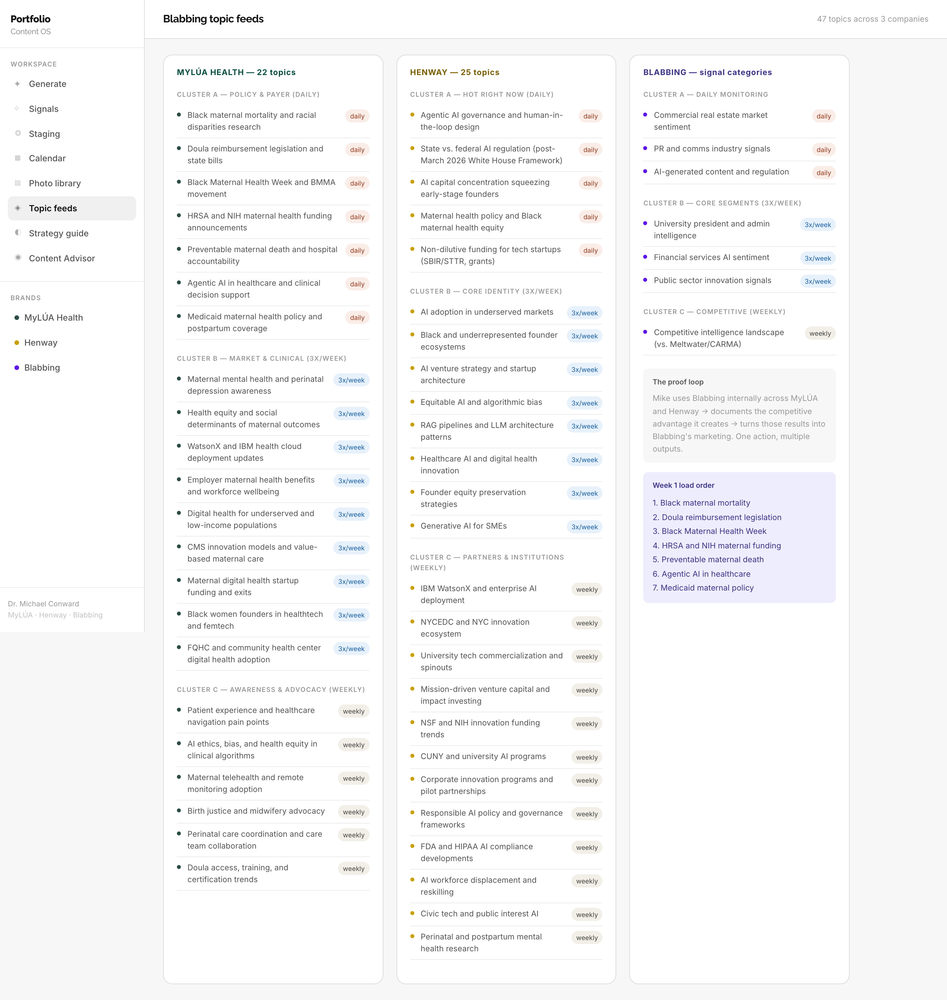
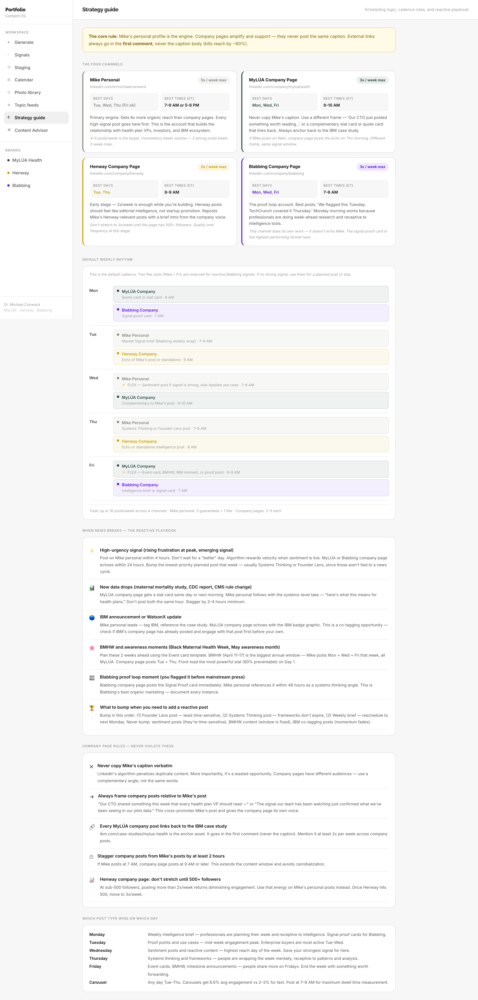
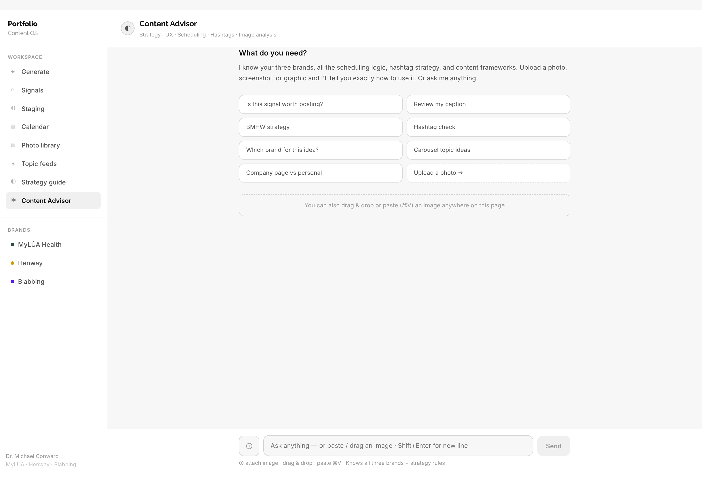
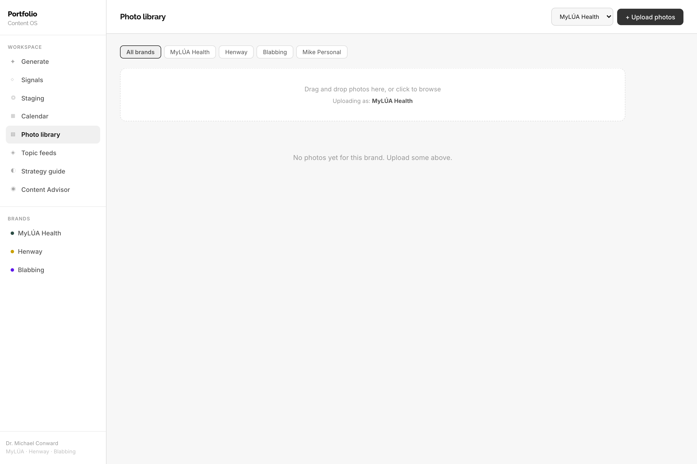

# Portfolio Content OS — Operating Guide & SOP

> **Read this first.** This is the plain-English manual for the whole system: what each screen does, how a post travels from a raw signal to a scheduled card, how the AI is prompted (the "content brain"), what the Content Advisor knows, and — for every piece — **which file to open if you want to change it.**

Built for Dr. Michael Conward's three-brand portfolio: **MyLÚA Health**, **Henway**, **Blabbing** (plus a "Mike Personal" voice).
Stack: Next.js 14 (pages router) · Anthropic API (Claude) · `@vercel/og` for graphics · Upstash Redis (calendar + signals) · Vercel Blob (photos + saved graphics).

---

## Table of contents

1. [The big picture](#1-the-big-picture)
2. [The daily workflow (SOP)](#2-the-daily-workflow-sop)
3. [Screen-by-screen](#3-screen-by-screen)
   - [Generate](#generate-) · [Signals](#signals-) · [Staging](#staging-) · [Calendar](#calendar-) · [Topic feeds](#topic-feeds-) · [Strategy guide](#strategy-guide-) · [Content Advisor](#content-advisor-) · [Photo library](#photo-library-)
4. [The content brain — how posts get written](#4-the-content-brain--how-posts-get-written)
5. [The Content Advisor — prompt engineering & capabilities](#5-the-content-advisor--prompt-engineering--capabilities)
6. [The graphics engine](#6-the-graphics-engine)
7. [Blabbing signal ingestion](#7-blabbing-signal-ingestion)
8. ["Where do I edit X?" — quick reference](#8-where-do-i-edit-x--quick-reference)
9. [Models, environment & deploy](#9-models-environment--deploy)

---

## 1. The big picture

The app is a left sidebar + a main workspace. Eight sections, each a page under `pages/`:

| Section | What it's for | File |
|---|---|---|
| **Generate** | Start a post — pick brand + type, paste a signal, get AI drafts | `pages/index.js` |
| **Signals** | Inbox of Blabbing market signals; "Draft this →" pre-fills Generate | `pages/signals.js` |
| **Staging** | Review/edit a draft, preview the graphic, schedule it | `pages/staging.js` |
| **Calendar** | Week view of everything scheduled across all brands | `pages/calendar.js` |
| **Photo library** | Brand-tagged photo storage | `pages/library.js` |
| **Topic feeds** | The 47 topics Blabbing monitors per brand | `pages/topics.js` |
| **Strategy guide** | The posting playbook — channels, cadence, reactive rules | `pages/strategy.js` |
| **Content Advisor** | A Claude chatbot that knows your whole portfolio | `pages/advisor.js` |

The **flow of a post** is: `Generate → Staging → Calendar`. Signals optionally feed the front of it. The Advisor sits to the side as a strategist you can ask anything.

The sidebar itself (nav order, labels, brand links) lives in `components/Layout.js`.

---

## 2. The daily workflow (SOP)

**The 60-second version, start to finish:**

1. **Open Signals.** Skim the Blabbing signals that came in. Each card already tells you the suggested emotional direction and whether it's heating up.
2. **Pick one → "Draft this →".** It drops you on the Generate screen with the signal text and a suggested sentiment already filled in.
3. **(Or skip Signals)** Go straight to **Generate**, choose the brand, choose a post type, paste anything (a headline, a stat, a raw idea), and hit **Generate**.
4. **Land on Staging.** Read the AI draft. Tweak the copy. Watch the graphic re-render live. Fix hashtags (chip editor keeps you at the ideal 3 for LinkedIn).
5. **Choose a channel + day/time.** The app warns you if a channel is at its weekly max or the day is off-strategy.
6. **Approve + schedule →.** The post lands on the **Calendar**. Download the graphic PNG and copy the caption when you're ready to post on LinkedIn.

Everything after the AI step is human-in-the-loop — nothing posts automatically. You always review, edit, and approve.

---

## 3. Screen-by-screen

### Generate ✦



The starting point for any post. Three decisions:

- **Brand** — MyLÚA, Henway, Blabbing, or Mike Personal. This picks the voice, the proof points, the hashtag bank, and the graphic templates that become available later.
- **Post type** — seven options (signal text, sentiment, stat card, carousel, weekly brief, use-case story, quote card). Each one swaps in different writing instructions.
- **Post count** — generate 1, 2, or 3 variations at once (top-right).

Paste your raw material into the big box and hit **Generate post →**. The drafts are stashed and you're routed to Staging.

**Sentiment post type** unlocks an extra panel:



When you pick **Sentiment post**, four emotional "archetypes" appear, plus an intensity slider (1–3). This is the highest-leverage control in the app — it's how a market signal gets matched to *how the audience already feels*:

| Archetype | Use when… | Timing rule |
|---|---|---|
| ↗ **Rising frustration** | Anger/urgency is building — name what people already feel | Post within 4 hrs of the signal peak |
| ◆ **Emerging signal** | Something is building before the mainstream notices | Post immediately — the value is being first |
| ↑ **Accelerating positive** | Hope/momentum building — amplify with specifics | Post 7–9 AM or 5–6 PM for max reach |
| △ **Shifting consensus** | The room is changing its mind — contrarian framing | Post while the shift is still news |

The **intensity slider** (subtle shift → moderate → peak signal) changes how blunt the AI is. Each archetype × intensity is a *different written instruction* — 12 combinations in total (see §4).

> **To edit the archetypes, their descriptions, timing advice, or the per-intensity instructions:** `lib/constants.js` → `SENTIMENT_TYPES`.
> **To edit the post types and their labels:** `lib/constants.js` → `POST_TYPES`.

---

### Signals ◇



The inbox of market signals coming from **Blabbing** (the B4B "Daily Pulse"). Each card shows:

- **Topic + date + source**
- A **momentum badge** (`↗ rising`, `↘ cooling`, `⇄ shifting`, `✦ new`, `→ steady`) — computed day-over-day, so you can see what's heating up.
- A **derived archetype** (e.g. "Rising frustration · peak signal") — the system reads Blabbing's 8-emotion breakdown and maps it onto the four archetypes above, so you don't have to classify it by hand.
- The **top emotions** with scores (Anger 72, Fear 55…).
- A **"why we suggested this"** line and a **⚠ needs enrichment** flag if the signal arrived missing data.
- **Draft this →** — hands the signal to the Generate screen, pre-filling the input text, switching to the Sentiment post type, and pre-selecting the suggested archetype + intensity. You can override any of it.

If you haven't wired up ingestion yet, this page shows an empty state explaining how signals arrive (see §7).

> **To change the trend badge styling:** `pages/signals.js` → `TREND_STYLE`.
> **To change the emotion→archetype mapping or momentum logic:** `lib/blabbing/` (see §7).

---

### Staging ◎



Where a raw AI draft becomes a finished, scheduled post. Left side is the **graphic**, right side is the **caption + scheduling**.

**Left — graphic:**
- A **live preview** rendered by the real graphics engine (not a mockup — it's the same `@vercel/og` image you'll post). It re-renders ~0.7s after any edit.
- **Platform** buttons (Instagram Feed 1080×1080, LinkedIn Feed 1200×627, X/Twitter, Instagram Story) change the canvas size.
- **Template** buttons — the card layouts available for that brand (e.g. MyLÚA: Stat card / Quote card / Announce).
- **Download graphic PNG** saves the image.

**Right — caption + scheduling:**
- **Caption** — fully editable text area.
- **Hashtag chip editor** — add/remove hashtags as chips; a live counter nudges you toward 3 for LinkedIn (green at 3, amber under, red over). Hashtags stay synced to the bottom of the caption.
- **Posting channel** — Mike Personal, or the three company pages. Each shows its best days and a live `n/max this week` status pulled from the calendar.
- **Schedule** — date + time picker, pre-filled with a smart default for the channel. A green ✓ or amber ⚠ tells you if the slot is on-strategy.
- **Approve + schedule →** writes the post to the calendar. **Skip** moves to the next draft.

Click **Show scheduling guide** (top-right) to drop in the full cadence cheat-sheet without leaving the page:



> **To edit channel definitions (best days, times, weekly max, notes):** `pages/staging.js` → `CHANNELS` (this is duplicated in `pages/strategy.js` for the standalone guide — keep them in sync).
> **To change the render debounce or which graphic fields are used:** `pages/staging.js` → the render `useEffect`.

---

### Calendar ▦



A Mon–Fri week view of everything scheduled, color-coded by brand. The top metric row counts posts per brand for the week. Click any post to open a detail panel where you can **copy** the caption, **reschedule** (date picker), or **delete** it.

- Filter by brand with the buttons top-right.
- Navigate weeks with **← prev / next →**.
- It merges two sources: a built-in **seed week** of example posts (so the calendar is never empty for a demo) and your **saved posts** from Redis.

> **To edit the seed/example posts:** `lib/constants.js` → `WEEK_SEED_POSTS`.
> **Saved posts are read/written via** `pages/api/calendar.js` (Redis).

---

### Topic feeds ◈



Reference view of the **47 topics** Blabbing monitors, grouped by brand and by cluster (daily / 3×week / weekly cadence). This is the source list that *should* feed the Signals inbox. Includes the "proof loop" explainer and a Week-1 load order for MyLÚA.

> **To edit the monitored topics:** `lib/constants.js` → `MYLUA_TOPICS`, `HENWAY_TOPICS`, `BLABBING_TOPICS`.

---

### Strategy guide ◐



The full posting playbook in one page — no AI, just the rules:

- **The four channels** with best days, times, weekly max, and the role each plays (Mike Personal is the engine; company pages amplify).
- **Default weekly rhythm** — what posts where, with two reactive "flex" slots.
- **Reactive playbook** — exactly what to do when news breaks, data drops, IBM posts, BMHW arrives, or Blabbing scoops the press.
- **Company-page rules** you should never break (never copy Mike's caption, links in first comment, stagger by 2 hrs…).
- **Which post type wins on which day.**

This is editorial content you maintain by hand — treat it as your written strategy of record.

> **To edit it:** `pages/strategy.js` (the `ChannelCard`, `DayRow`, and `Rule` blocks are just data you fill in).

---

### Content Advisor ◉



A full Claude chat that has your entire portfolio loaded into its system prompt — brands, ICPs, proof points, voice rules, scheduling logic, hashtag strategy. Use it to decide if a signal is worth posting, which brand an idea belongs to, whether a caption hits the right buyer, or to plan a campaign.

It's **vision-capable**: drag, paste (⌘V), or upload an image (a photo, a screenshot of a Blabbing dashboard, a competitor post, a graphic you're designing) and it returns a structured read — what it sees, which brand it fits, the best post type, the hook, the channel + timing, and 3 hashtags.

The suggested-prompt buttons are starting points; some pre-fill a template with `[brackets]` for you to complete. Full detail on what it knows and how to tune it is in §5.

> **To edit what the Advisor knows or how it behaves:** `pages/api/advisor.js` → `ADVISOR_SYSTEM`.
> **To edit the suggested prompts:** `pages/advisor.js` → `SUGGESTED_PROMPTS`.

---

### Photo library ▤



Brand-tagged photo storage backed by Vercel Blob. Pick a brand, drag-drop or browse to upload, filter by brand, delete with the ×. Intended as the asset shelf for event photos and consumer imagery you'll pair with posts.

> **Backed by** `pages/api/upload.js` (write) and `pages/api/photos.js` (list/delete).

---

## 4. The content brain — how posts get written

This is the most valuable part of the system and the part most worth understanding before you edit it. **All of it lives in one file: `pages/api/generate.js`** (with the brand voices in `lib/constants.js`).

When you hit **Generate**, the server assembles one big **system prompt** from five stacked layers, then asks Claude to write the post. Here's the stack, top to bottom:

```
┌─ 1. BRAND SYSTEM PROMPT     (who the brand is, ICP, proof points, hard rules)
├─ 2. PERSONA LAYER           (the "lenses" — Hormozi / Naval / Gary Vee / etc.)
├─ 3. POST TYPE INSTRUCTION   (signal / sentiment / stat / carousel / brief / usecase / quote)
├─ 4. SENTIMENT CONTEXT       (only for sentiment posts: archetype × intensity instruction)
├─ 5. HASHTAG RULES           (platform-aware, brand bank, never-use list)
└─ 6. FORMAT RULES            (hook first, short paragraphs, → arrows, banned words)
```

**1. Brand system prompt** — `lib/constants.js` → `BRANDS[brand].systemPrompt`. Each brand carries its identity, ICP, the exact proof points it's allowed to cite, and **hard rules** (e.g. *never attribute MyLÚA's pilot stats to IBM*, *never call J'Vanay "certified"*, *never reveal patent mechanics*). This is the first place to edit if a brand is saying the wrong thing.

**2. Persona layer** — `generate.js` → `PERSONA_LAYERS`. On top of the brand voice, each brand blends a few well-known operator "lenses" (e.g. MyLÚA = Hormozi value-clarity + Chris Walker B2B trust + Geoffrey Moore category design). They're applied *invisibly* — the post should read like Mike, not like a framework.

**3. Post type instruction** — `generate.js` → `POST_TYPE_INSTRUCTIONS`. One paragraph per type telling Claude the structure (a stat card leads with one number; a carousel outputs 6 slide scripts; a use-case story uses "In a recent [sector] deployment…").

**4. Sentiment context** — only added for the Sentiment post type. It pulls the exact instruction for the chosen **archetype × intensity** from `lib/constants.js` → `SENTIMENT_TYPES[id].instructions[1|2|3]`. This is the 4×3 = 12-instruction matrix. Example — Rising frustration at intensity 3: *"Peak frustration signal… Open with the most direct, unhedged statement of the problem. Make the reader feel seen immediately."*

**5. Hashtag rules** — `generate.js` → `HASHTAG_BANKS` + `buildHashtagInstruction()`. Each brand has a **Tier-1 pool**, a **never-use list** (no `#AI`, `#Tech`, `#Health`…), and **context rules** (a MyLÚA post about policy pulls `#Medicaid #HealthPolicy…`). The number of hashtags adapts to the platform (LinkedIn 3, Instagram 8, X 0–1). Claude is told to pick by *what the post is actually about*, not generic brand tags.

**6. Format rules** — `generate.js` → `formatRules`. Universal: hook first, never open with a question, 1–3 sentence paragraphs, `→` arrows not bullets, a data point behind every claim, links in first comment, and a banned-words list (*revolutionizing, transforming, disrupting, game-changing, excited to announce*).

**After the copy is written**, `deriveGraphic()` (in `generate.js`) reads the post back and pulls out structured fields — the hero stat, a pull-quote, an attribution line, a headline — so the graphic card reflects the *actual words*, with no second API call. It also suggests which template fits.

**Model & length:** post generation uses **`claude-haiku-4-5`** with a 1,200-token cap (fast + cheap, since the structure is heavily specified). To change the model, edit the `model:` line near the bottom of `generate.js`.

> **Mental model for editing:** brand *identity & rules* → `constants.js`. Everything about *how it's written* (lenses, post types, hashtags, format, banned words, model) → `generate.js`.

---

## 5. The Content Advisor — prompt engineering & capabilities

The Advisor is a separate Claude instance with its own large system prompt. It does **not** write posts — it advises. Everything lives in `pages/api/advisor.js` (`ADVISOR_SYSTEM`) and the chat UI in `pages/advisor.js`.

**What's baked into its knowledge (the system prompt):**
- **Full portfolio dossier** — all three brands with co-founders, IBM relationship, proof points, ICPs, pricing, websites, fundraising status.
- **Scheduling strategy** — the 4 channels, cadence, best days/times, the "Mike personal = 8× reach" rule, links-in-first-comment.
- **Hashtag rules** — per-brand top tags and the dynamic "match the post, not the brand" principle.
- **The composite persona model** — the same Hormozi/Walker/Gary Vee/Naval/Moore lenses used by the generator, so its advice is consistent with what the generator produces.
- **Content pillars** per brand and the **brand voice rules** it must never violate (same banned words, same IBM/doula/patent guardrails).
- **An image-analysis protocol** — a fixed 7-point structure it follows for any uploaded image (what it sees → brand fit → best post type → hook → channel + timing → 3 hashtags → red flags).
- **A style contract** — direct, opinionated, gives a recommendation not a menu, never says "Great question!"/"Absolutely!".

**Capabilities:**
- **Strategy Q&A** — "Is this signal worth posting?", "Which brand for this idea?", "Company page vs personal?"
- **Caption review** — paste a draft, get ICP/voice feedback.
- **Campaign planning** — e.g. a full BMHW week across all four channels.
- **Vision / image analysis** — drag-drop, paste (⌘V), or upload. If you send an image with no question, it auto-runs the full 7-point read. The frontend builds proper Anthropic multimodal message blocks (`pages/advisor.js` → `send()`).
- **Multi-turn memory** within a conversation (it keeps the running message history; **New conversation** resets it).

**Model & length:** the Advisor uses **`claude-sonnet-4-6`** (vision-capable, smarter than the generator's Haiku) with a 1,000-token cap. The model line is in `pages/api/advisor.js`.

> ⚠️ **Known footgun:** an older retired model id (`claude-sonnet-4-20250514`) once caused "Something went wrong" errors here. If the Advisor breaks after a model change, check that the id in `advisor.js` is a current one. See §9.

**To tune the Advisor's behavior**, edit `ADVISOR_SYSTEM` — add proof points, change the tone, adjust the image protocol, update pricing. To change the starter buttons, edit `SUGGESTED_PROMPTS` in `pages/advisor.js`.

---

## 6. The graphics engine

The cards you see in Staging are real images generated server-side by **`@vercel/og`** (Satori) — chosen specifically because it deploys reliably on Vercel (an earlier headless-Chromium approach kept dying on deploy). Key rule: **everything is flexbox** (Satori doesn't support CSS grid).

**The pieces:**
- `pages/api/render.js` — the endpoint. Takes `{ brand, template, platform, data }`, resolves logos into data-URIs server-side (so there are no CORS/tainted-canvas problems), rasterizes to PNG, and returns either inline base64 (preview) or a Blob URL (when `persist: true`).
- `lib/templates/index.js` — the **8 card layouts**, as flexbox React elements. This is where you change how a card *looks*.
- `lib/brandTokens.js` — per-brand colors, fonts, accents (single source of truth for the templates).
- `lib/fonts.js` + `assets/fonts/` — the bundled TTFs (Poppins / Raleway / Inter). `next.config.js` is configured to ship these fonts into the serverless function — **don't remove that config or graphics break on deploy.**
- `lib/imageFetch.js` — fetches logos and fails *soft* to a clean wordmark, so a missing logo never produces a broken or invented image.

**Templates available per brand** (`lib/templates/index.js` → `TEMPLATE_META`):

| Brand | Templates |
|---|---|
| MyLÚA | Stat card (cream) · Quote card · Announce (teal) |
| Henway | Stat card (black/yellow) · Quote card · Market Signal |
| Blabbing | Intelligence Brief (sentiment pill) · Signal Proof |
| Mike | Founder Note (insight + photo) |

> **To restyle a card:** `lib/templates/index.js` (find the function, e.g. `myluaStat`).
> **To change brand colors/fonts:** `lib/brandTokens.js`.
> **To add a platform size:** `lib/constants.js` → `PLATFORM_SIZES`.
> **Asset note:** Henway only has a *black* logo (the white one 404s), so dark Henway cards use the yellow wordmark and the black logo only appears on the light Quote card. Logo selection logic is in `render.js` → `logoUrlFor()`.

---

## 7. Blabbing signal ingestion

This is how the **Signals** inbox gets populated automatically from Blabbing's "B4B Daily Pulse." It's an optional pipeline — the rest of the app works without it.

**The flow:**
```
B4B Daily Pulse  →  POST /api/ingest/blabbing  →  parse → normalize → dedup → store (Redis)
                                                  → derive archetype × intensity (from emotions)
                                                  → tag day-over-day momentum
        Signals page  ←  GET /api/ingest/blabbing  ←  ─────────────────────────────────┘
```

**The pieces:**
- `pages/api/ingest/blabbing.js` — the single entry point. `POST` accepts a raw `.eml` string, a single signal, or a `{ signals: [] }` batch; auth is the `X-B4B-Secret` header matching the `BLABBING_INGEST_SECRET` env var. `GET` reads signals back for the dashboard.
- `lib/blabbing/parseSignal.js` — turns an incoming email/payload into one normalized signal shape, and `deriveContentSignal()` maps Blabbing's 8-emotion breakdown (Plutchik) onto the four archetypes × intensity. It never invents fields — missing data is flagged.
- `lib/blabbing/signalStore.js` — Upstash Redis store; dedupes on message id, and `computeMomentum()` produces the day-over-day trend (new / rising / cooling / shifting / flat).
- `lib/blabbing/describe.js` — the presentational helpers (`topEmotions`, `describeMomentum`, `explainSuggestion`) the Signals page and Generate banner use.
- `docs/blabbing-ingestion-contract.md` — the spec to hand Blabbing's side so the email carries the structured data.

**Key insight worth remembering:** the system's four archetypes (`fr` / `em` / `po` / `co`) are *not* the same as Blabbing's "Positive/Neutral/Negative" sentiment label. The **8 emotion scores** are the high-value field — they're what map cleanly into archetype × intensity. If a signal only carries the coarse label, it'll show **⚠ needs enrichment**.

**To turn it on:** set `BLABBING_INGEST_SECRET` in Vercel, give the same value to Blabbing's webhook (or a Gmail-label forwarder), and signals start appearing. Until then, Signals shows its empty state.

---

## 8. "Where do I edit X?" — quick reference

| I want to change… | Open this |
|---|---|
| **A brand's voice, ICP, proof points, hard rules** | `lib/constants.js` → `BRANDS[brand].systemPrompt` |
| **The persona "lenses" applied per brand** | `pages/api/generate.js` → `PERSONA_LAYERS` |
| **How each post type is structured** | `pages/api/generate.js` → `POST_TYPE_INSTRUCTIONS` |
| **Sentiment archetypes, intensity instructions, timing** | `lib/constants.js` → `SENTIMENT_TYPES` |
| **Hashtag pools / never-use lists / context rules** | `pages/api/generate.js` → `HASHTAG_BANKS` |
| **Universal format rules & banned words** | `pages/api/generate.js` → `formatRules` |
| **The post-generation model** | `pages/api/generate.js` → `model:` |
| **What the Content Advisor knows / how it acts** | `pages/api/advisor.js` → `ADVISOR_SYSTEM` |
| **The Advisor model / suggested prompts** | `pages/api/advisor.js` (model) · `pages/advisor.js` → `SUGGESTED_PROMPTS` |
| **How a graphic card looks** | `lib/templates/index.js` |
| **Brand colors & fonts in graphics** | `lib/brandTokens.js` |
| **Platform/canvas sizes** | `lib/constants.js` → `PLATFORM_SIZES` |
| **Channels: best days, times, weekly max** | `pages/staging.js` → `CHANNELS` (mirror in `pages/strategy.js`) |
| **The written strategy playbook** | `pages/strategy.js` |
| **Monitored Blabbing topics** | `lib/constants.js` → `MYLUA_TOPICS` / `HENWAY_TOPICS` / `BLABBING_TOPICS` |
| **Example calendar posts (seed week)** | `lib/constants.js` → `WEEK_SEED_POSTS` |
| **Sidebar nav order / labels** | `components/Layout.js` → `NAV` |
| **Signal parsing / archetype mapping / momentum** | `lib/blabbing/` |

---

## 9. Models, environment & deploy

**Claude models in use** (both via `@anthropic-ai/sdk`):
- Post generation → **`claude-haiku-4-5`** (`pages/api/generate.js`) — fast/cheap; the prompt does the heavy lifting.
- Content Advisor → **`claude-sonnet-4-6`** (`pages/api/advisor.js`) — smarter + vision-capable.

> When updating a model id, use a **current** one. Retired ids return errors that surface in the UI as "Something went wrong." Check the latest ids before changing.

**Environment variables** (see `.env.example`; set the same in Vercel):
- `ANTHROPIC_API_KEY` — required for Generate and the Advisor.
- Redis (`KV_REST_API_URL` / `KV_REST_API_TOKEN`, with `NewRedis_`-prefixed or `UPSTASH_*` fallbacks) — calendar + signals storage. `lib/redis.js` is the single shared client.
- `BLOB_READ_WRITE_TOKEN` — photo library + persisted graphics.
- `BLABBING_INGEST_SECRET` — guards the signal ingestion endpoint.

**Run locally:**
```bash
npm install
npm run dev          # http://localhost:3000
```
Most screens work without any keys. Generate and the Advisor need `ANTHROPIC_API_KEY`; Calendar/Signals/Library need their stores; the **graphic preview renders fine offline** (it only needs Blob for the *persist* path).

**Deploy:** push to the GitHub repo connected to Vercel; production builds from `main`. Ensure all env vars are set for the Production environment.

---

*This guide reflects the codebase as of the current branch. Screenshots live in `docs/screenshots/` and can be regenerated by running the app and re-shooting each page.*
